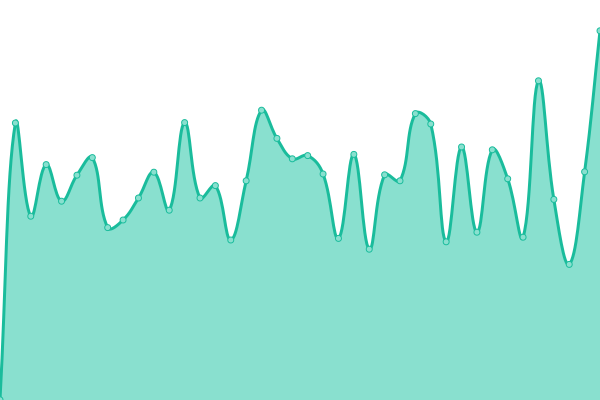

# [📈 Live Status](https://dotsi.github.io/bitamiuptime): <!--live status--> **🟩 All systems operational**

This repository contains the open-source uptime monitor and status page for [Miha](https://dotsi.github.io/bitamiuptime), powered by [Upptime](https://github.com/upptime/upptime).

With [Upptime](https://upptime.js.org), you can get your own unlimited and free uptime monitor and status page, powered entirely by a GitHub repository. We use [Issues](https://github.com/dotsi/bitamiuptime/issues) as incident reports, [Actions](https://github.com/dotsi/bitamiuptime/actions) as uptime monitors, and [Pages](https://dotsi.github.io/bitamiuptime) for the status page.

<!--start: status pages-->
<!-- This summary is generated by Upptime (https://github.com/upptime/upptime) -->
<!-- Do not edit this manually, your changes will be overwritten -->
<!-- prettier-ignore -->
| URL | Status | History | Response Time | Uptime |
| --- | ------ | ------- | ------------- | ------ |
|  [Be-terna](https://www.be-terna.com/) | 🟩 Up | [be-terna.yml](https://github.com/dotsi/bitamiuptime/commits/HEAD/history/be-terna.yml) | 

 1303ms
     
 | 

<a href="https://dotsi.github.io/bitamiuptime/history/be-terna">100.00%</a>
    

|  [Adacta](https://www.adacta-fintech.com/) | 🟩 Up | [adacta.yml](https://github.com/dotsi/bitamiuptime/commits/HEAD/history/adacta.yml) | 

 1006ms
     
 | 

<a href="https://dotsi.github.io/bitamiuptime/history/adacta">100.00%</a>
    

|  [Spica.com](https://www.spica.com/) | 🟩 Up | [spica-com.yml](https://github.com/dotsi/bitamiuptime/commits/HEAD/history/spica-com.yml) | 

 1162ms
     
 | 

<a href="https://dotsi.github.io/bitamiuptime/history/spica-com">100.00%</a>
    

|  [Spica.si](https://www.spica.si/) | 🟩 Up | [spica-si.yml](https://github.com/dotsi/bitamiuptime/commits/HEAD/history/spica-si.yml) | 

 1110ms
     
 | 

<a href="https://dotsi.github.io/bitamiuptime/history/spica-si">100.00%</a>
    

|  [Allhours.com](https://www.allhours.com/) | 🟩 Up | [allhours-com.yml](https://github.com/dotsi/bitamiuptime/commits/HEAD/history/allhours-com.yml) | 

 1377ms
     
 | 

<a href="https://dotsi.github.io/bitamiuptime/history/allhours-com">100.00%</a>
    

|  [Biseri-jadrana.si](https://www.biseri-jadrana.si/) | 🟩 Up | [biseri-jadrana-si.yml](https://github.com/dotsi/bitamiuptime/commits/HEAD/history/biseri-jadrana-si.yml) | 

 4094ms
     
 | 

<a href="https://dotsi.github.io/bitamiuptime/history/biseri-jadrana-si">100.00%</a>
    

<!--end: status pages-->

[**Visit our status website →**](https://dotsi.github.io/bitamiuptime)

## 📄 License

- Powered by: [Upptime](https://github.com/upptime/upptime)
- Code: [MIT](./LICENSE) © [Miha](https://dotsi.github.io/bitamiuptime)
- Data in the `./history` directory: [Open Database License](https://opendatacommons.org/licenses/odbl/1-0/)
